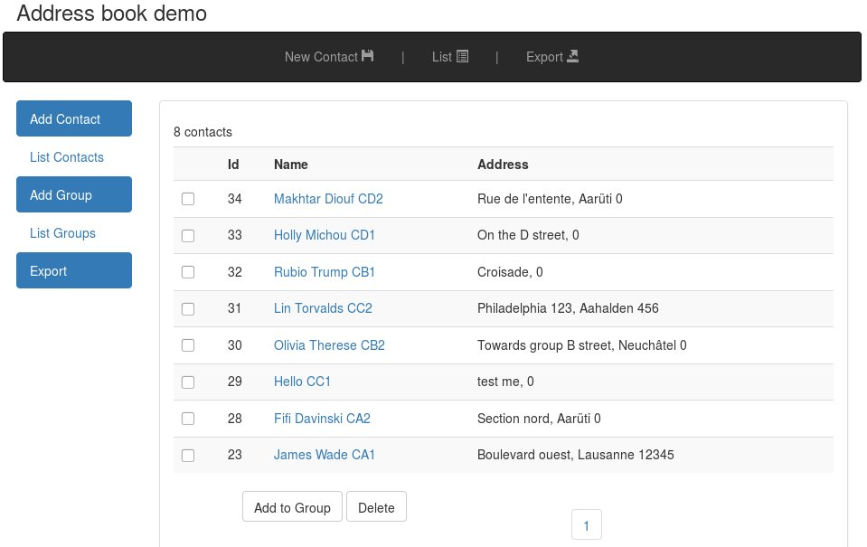

This package contains an Address Book demo application, 
written in Plain PHP 5, and organized in a near MVC-like structure.

Features: 
 - CRUD operations for managing contacts and groups
 - Add contacts to hierarchical groups, inherit between groups
 - Export all contacts to an XML file

 

For a more demanding app, I would preferably use NodeJS, Symfony or Laravel for faster implementation, 
better security features and DB abstraction.

DATABASE:
- Driver: pdo-mysql
- set parmeters in addbook/config.php
- import the DB schema from addbook/tests/addbook201603.sql
- If debugging is enabled, queries and info/error messages will be logged in addbook.log
 
* Credentials:

    GRANT SELECT, INSERT, UPDATE, DELETE ON `addbook`.* TO 'demo'@'localhost' IDENTIFIED BY ';demo;' ;

UI:
- jQuery 1.12 & Bootstrap 3.3 frameworks are used for a responsive layout across device sizes.
- Resources files (css, js, fonts) are stored under addbook/res/ to work offline.
- addbook/index.php serves as front controller.

Deployment on Linux:
- Internal PHP test server:  cd addbook/ ; sudo php -S localhost:9000 &

Apache (Ubuntu): 

    * sudo cp -R addbook /var/www/html/ 

    * sudo chown -R www-data.www-data /var/www/html/addbook

Author: Makhtar Diouf 

2016-03
